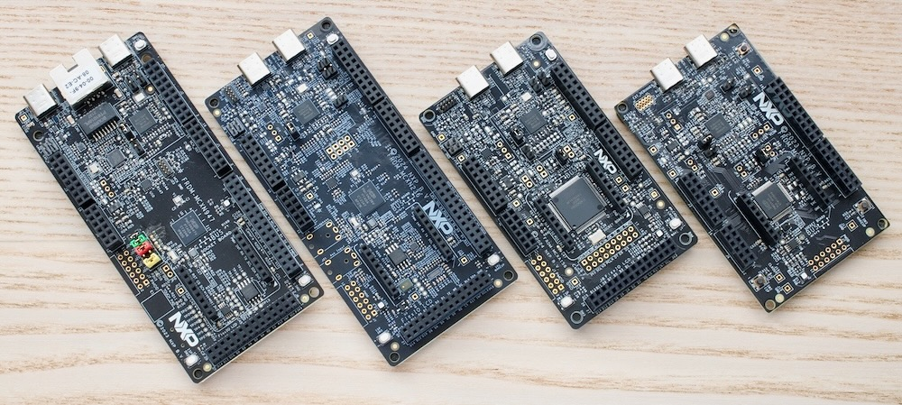

# arduino_shields_on_mcx

## What is this?

The `arduino_shields_on_mcx` is sample/demo project collection for NXP interface products Arduino shield boards.  
The projects can be built on MCUXpresso IDE or MCUXpresso VSC. Target MCU boreds are FRDM-MCXN947, FRDM-MCXN236, FRDM-MCXA156 and FRDM-MCXA153.    
These projects are based on library: [`r01lib`](https://github.com/teddokano/r01lib). 

*NXP FRDM boards: N947, N236, A156 and A153 (from left to right)*

## Supported Arduino shields

Currently, following Arduino shields are supported.

|category|board|
|---|---|
|BusRepeater |   PCA9617ADP-ARD                      |
|GPIO        |   PCAL6408A-ARD                       |
|GPIO        |   PCAL6416AEV-ARD                     |
|GPIO        |   PCAL6524EV-ARD                      |
|GPIO        |   PCAL6534EV-ARD                      |
|GPIO        |   PCAL6534EV-ARD                      |
|GPIO        |   PCAL9722HN-ARD                      |
|LCD         |   PCA8561AHN-ARD						 |
|LED         |   PCA9955BTW-ARD                      |
|LED         |   PCA9957HN-ARD                       |
|MuxSw       |   PCA9846PW-ARD                       |
|RTC         |   PCF2131-ARD                    	 |
|RTC         |   PCF85053ATK-ARD                     |
|RTC         |   PCF85053ATK-ARD                     |
|RTC         |   PCF85063AT-ARD                      |
|RTC         |   PCF85063TP-ARD                      |
|RTC         |   PCF85263ATL-ARD                     |
|TempSensor  |   P3T1035xUK & P3T2030xUK-ARD         |
|TempSensor  |   P3T1085DP-ARD                       |
|TempSensor  |   P3T1755DP-ARD                       |
|TempSensor  |   PCT2075DP-ARD                       |
|VLT (Voltage Level Translator) |   NTS0304EUK-ARD   |

